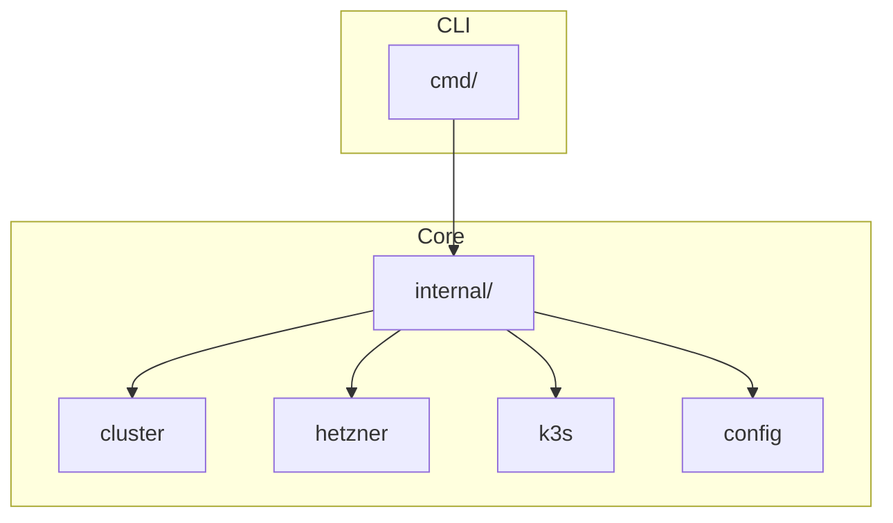
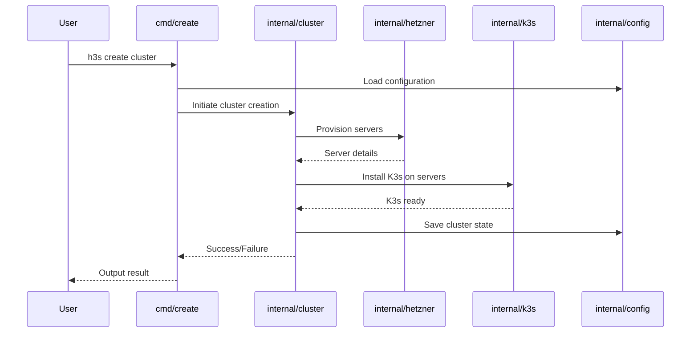
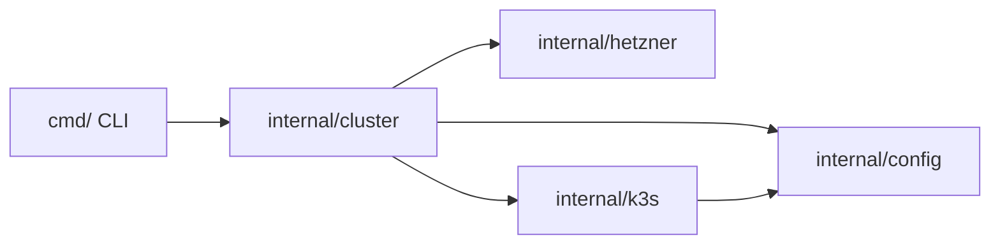

[](https://codecov.io/gh/imamik/h3s)


# H3S - Hetzner K3s Cluster Manager

A powerful CLI tool for creating, managing, and operating K3s clusters on Hetzner Cloud. H3S simplifies the process of deploying and managing Kubernetes clusters while providing advanced features for cluster lifecycle management.

## Features

- 🚀 Quick cluster creation and management
- 🔒 Built-in security features and firewall configuration
- 🔄 Easy cluster scaling and node management
- 🛠 Integrated kubectl command support
- 📦 Automated dependency management
- 🔑 SSH access to cluster nodes
- ⚡ Fast and efficient cluster operations
- 🌐 Automatic DNS management with Hetzner DNS
- 🔐 Built-in cert-manager integration
- 💻 Interactive configuration creation

## Prerequisites

- Hetzner Cloud API token
- Hetzner DNS API token (optional, for DNS management)
- kubectl installed locally
- SSH key pair for node access

## Installation

```bash
# Using go install
go install github.com/imamik/h3s@latest

# Or clone and build manually
git clone https://github.com/imamik/h3s.git
cd h3s
make build
```

## Makefile Targets for Meta-Development

The following Makefile targets are provided to streamline meta-development workflows:

- `make dev` — Setup the development environment (installs pre-commit hooks and tools)
- `make complexity-report` — Run task complexity analysis and print a formatted report
- `make task ARGS="<command>"` — Wrapper for the task-master CLI (e.g., `make task ARGS="list"`)
- `make diagram` — Generate architecture diagrams using PlantUML (requires `plantuml` and a `docs/architecture.puml` file)

Example usage:

```bash
make dev
make complexity-report
make task ARGS="list"
make diagram
```

## Testing

H3S has a comprehensive test suite including unit tests, integration tests, and end-to-end tests. The tests are organized by type and can be run using the following Makefile targets:

- `make test` — Run all tests
- `make unit-test` — Run unit tests only
- `make integration-test` — Run integration tests only
- `make e2e-test` — Run end-to-end tests only (optionally: `NAME=TestName`)
- `make bench` — Run benchmarks (optionally: `NAME=BenchmarkName`)

Example usage:

```bash
# Run all tests
make test

# Run only unit tests
make unit-test

# Run a specific integration test
make integration-test NAME=TestConfigValidationIntegration

# Run benchmarks
make bench
```

### Test Environment Variables

- `H3S_ENABLE_E2E_TESTS=1` — Enable end-to-end tests (disabled by default)
- `H3S_ENABLE_REAL_INTEGRATION=1` — Enable tests that interact with real Hetzner APIs (disabled by default)
- `H3S_NON_INTERACTIVE=1` — Disable interactive prompts in tests

See [CONTRIBUTING.md](CONTRIBUTING.md) for more details on testing standards and guidelines.

## Quick Start

1. Create your configuration interactively:

```bash
# Create cluster configuration
h3s create config

# Create credentials configuration
h3s create credentials
```

Or manually create the `h3s.yaml` and `h3s-secrets.yaml` configuration files as
described in the [Configuration](#configuration) section below.

2. Create a cluster:

```bash
h3s create cluster
```

## Available Commands

### Create Commands

```bash
# Create a new configuration interactively
h3s create config

# Create credentials configuration interactively
h3s create credentials

# Create a new cluster
h3s create cluster
```

### Get Commands

```bash
# Get cluster kubeconfig
h3s get kubeconfig

# Get cluster access token
h3s get token
```

### Cluster Management

```bash
# Create a cluster
h3s create cluster

# SSH into a node
h3s ssh control-plane-1

# Use kubectl commands
h3s kubectl get nodes
h3s kubectl apply -f your-app.yaml

# Destroy cluster
h3s destroy
```

### Installation Commands

```bash
# Install dependencies
h3s install dependencies
```

## Configuration

### Basic Configuration (h3s.yaml)

The configuration is split into two files for better security practices:

- `h3s.yaml`: Contains non-sensitive cluster configuration
- `h3s-secrets.yaml`: Contains sensitive information like API tokens

Both files can be created interactively using the CLI or manually.

#### Main Configuration (h3s.yaml)

```yaml
name: my-cluster
k3s_version: v1.31.1+k3s1
network_zone: eu-central
domain: my-domain.com

# SSH Configuration
ssh_key_paths:
    private_key_path: $HOME/.ssh/id_ed25519
    public_key_path: $HOME/.ssh/id_ed25519.pub

# Certificate Management
cert_manager:
    email: your-email@domain.com
    production: false

# Node Configuration
control_plane:
    as_worker_pool: true
    pool:
        name: control-plane
        nodes: 3
        location: nbg1
        instance: cax11

worker_pools:
    - name: worker
      nodes: 2
      location: nbg1
      instance: cax11
```

#### Secrets Configuration (h3s-secrets.yaml)

```yaml
hcloud_token: your-hetzner-cloud-token
hetzner_dns_token: your-hetzner-dns-token
k3s_token: your-k3s-token
```

## Git Hooks

This project uses [lefthook](https://github.com/evilmartians/lefthook) to manage Git hooks for ensuring code quality and testing standards.

### Setup

To install the hooks and required dependencies, run:

```sh
./scripts/setup_hooks.sh
```

This script will install:
- lefthook (hook manager)
- golangci-lint (linter)
- gitleaks (secret scanner)
- ineffassign (detects ineffective assignments)

### Available Hooks

#### Pre-commit Hooks
Run automatically before each commit:
- **go-fmt**: Formats Go code
- **go-test-unit**: Runs unit tests for changed packages only
- **golangci-lint**: Runs linting checks
- **gitleaks**: Scans for secrets in staged changes
- **ineffassign**: Checks for ineffective assignments

#### Commit Message Hooks
- **validate-conventional-commit**: Ensures commit messages follow the [Conventional Commits](https://www.conventionalcommits.org/) format (e.g., `feat(component): description`)

#### Pre-push Hooks
Run automatically before pushing to remote:
- **run-all-tests**: Runs all tests including integration tests
- **check-coverage**: Ensures test coverage meets minimum threshold

### Skipping Hooks

You can skip pre-commit hooks when necessary:

```sh
# Skip pre-commit hooks
git commit --no-verify

# Skip pre-push hooks
git push --no-verify
```

### Custom Test Scripts

The hooks use custom scripts in the `scripts/hooks/` directory:
- `run_unit_tests.sh`: Runs unit tests for changed packages only
- `check_coverage.sh`: Checks if test coverage meets the minimum threshold

For more details, see the [lefthook documentation](https://github.com/evilmartians/lefthook) and the `lefthook.yml` configuration file.

## Architecture

H3S follows a modular architecture with the following components:

- **cmd**: Command-line interface and command handlers
  - create: Cluster and configuration creation
  - get: Retrieve cluster information
  - destroy: Cluster cleanup
  - ssh: Node access
  - kubectl: Kubernetes operations
  - install: Dependency management
- **internal**: Core business logic and implementations
  - cluster: Cluster management logic
  - hetzner: Hetzner Cloud API integration
  - k3s: K3s specific operations
  - config: Configuration management

### High-Level Architecture



*The CLI layer (`cmd/`) handles user commands and delegates to the core logic in `internal/`, which is composed of modules for cluster management, Hetzner integration, K3s operations, and configuration.*

### Sequence Diagram: Cluster Creation



*This diagram shows the flow when a user creates a cluster, from CLI input to provisioning, K3s installation, and final state storage.*

### Component Interaction Diagram



*Major components and their interactions: the CLI interacts with cluster management, which coordinates with Hetzner, K3s, and configuration modules.*

## Contributing

Contributions are welcome! Please feel free to submit a Pull Request.

## License

This project is licensed under the MIT License - see the
[LICENSE.txt](LICENSE.txt) file for details.
